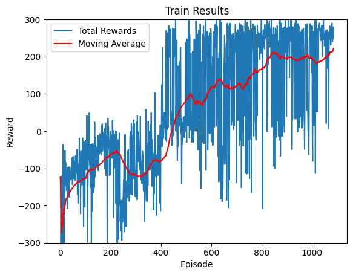
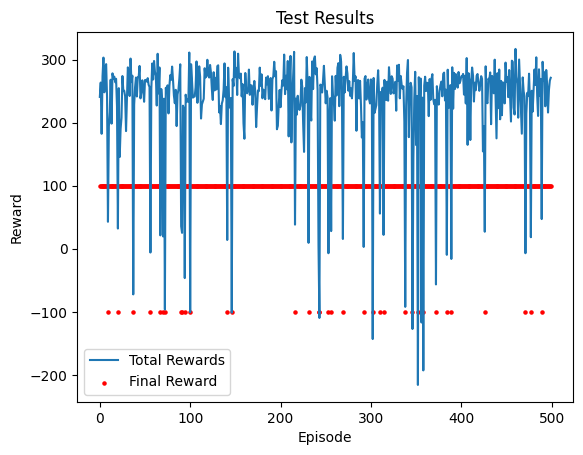

# Actor Critic
## The Pre-trained Model and data
We have provided a pre-trained model along with its training and testing data for your reference. The pre-trained models is named `trained_model` and the data can be found in the `A2C.pkl`.

Owing to the random seeds, the training result might not be able to replicate the best result. In the jupyter notebook, you may load the trained model and see the training process and test results. The expected result for the trained model should be like this. The expected successful landing rate is 90% (successful landing is defined as the reward for the last step being 100)

<p float="left">
    
     
</p>


## How to Train the Model
Make sure your directory is A2C-Feng Jiaxu


1. create a conda environment and activate it

```shell
conda create -n a2c jupyter notebook
conda activate a2c
```

2. install the required packages, swig is required for gym[box2d]. The following will install it if using __MacOS__, for Linux there is no need for installing swig, just pip install.

```shell
brew install swig
pip install -r requirements.txt
```

3. Open jupyter notebook and run the cells in order. Skip some parts if the annotation tell you so.