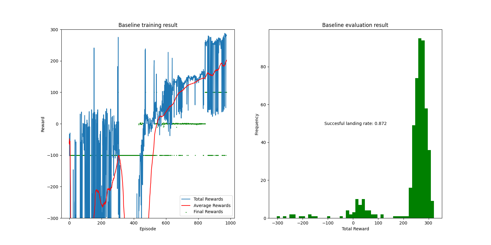
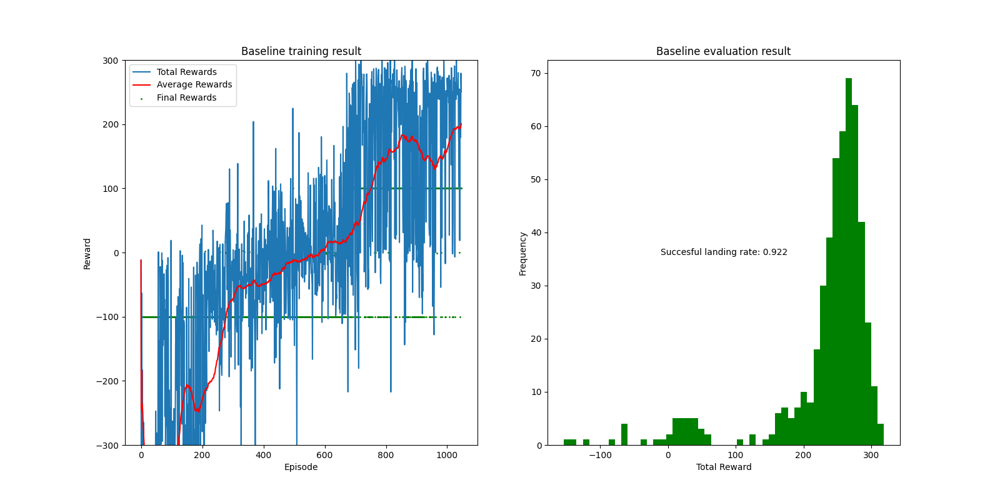

# Policy Gradient Methods
## The Pre-trained Models and data
We have provided two pre-trained models along with their training and testing data for your reference. The pre-trained models are located in the `Pretrained_model` directory and the data can be found in the `data` directory.

| Model Name | Train Data | Train Target | Test Data | Test Accuracy |
|------------|------------|--------------|-----------|-------------|
| LunarLander_fix_random | [./data/train_process/fix_random_train_data.pkl](./data/train_process/fix_random_train_data.pkl) | Average above 200 | [./data/test_process/fix_random_test_data.pkl](./data/test_process/fix_random_test_data.pkl) | 87% |
| LunarLander_best_luck_draw | [./data/train_process/luck_draw_train_data.pkl](./data/train_process/luck_draw_train_data.pkl) | Average above 200 | [./data/test_process/luck_draw_test_data.pkl](./data/test_process/luck_draw_test_data.pkl) | 92% |

If you test on linux system, you can guarantee to get the exact result as LunarLander_fix_random but if you test on other operating systems, the result may vary. The result of LunarLander_best_luck_draw is the best model we have trained so far.




## How to Train the Model
Make sure your directory is Adaptive Baseline-Zhang Xichen


1. create a conda environment and activate it

```shell
conda create -n pg python=3.10.12
conda activate pg
```

2. install the required packages, swig is required for gym[box2d]. The following will install it if using __MacOS__, for other operating systems please install swig through other means.

```shell
brew install swig
pip install -r requirements.txt
```

3. how to train the model

```shell
python train.py
```

the model will be saved in the model directory ./Pretrained_model model name should be lunarlander_0.02_0.9_0.999.pth

the data will be saved in the data directory ./data

train data is in the data directory ./data/train_process

test data is in the data directory ./data/test_process

4. how to test the model

```shell
python test.py
```

remember to change the model path in the test.py file

5. how to plot the result (plot.ipynb)

run all and if you finish train of the model, you can plot the result of the model